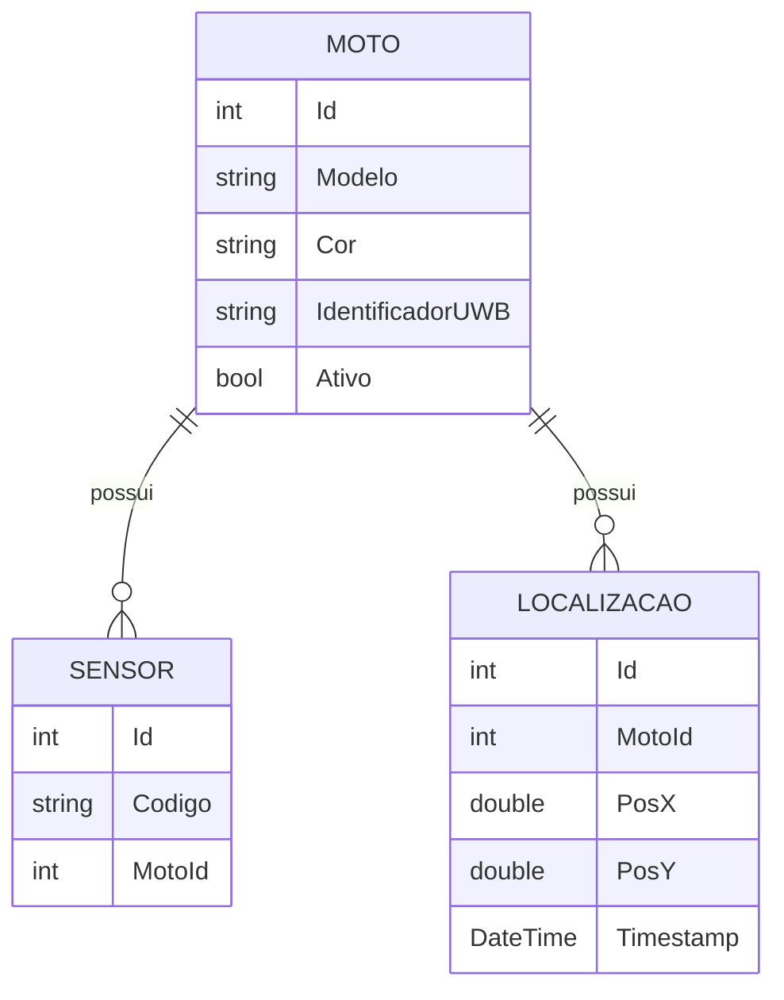
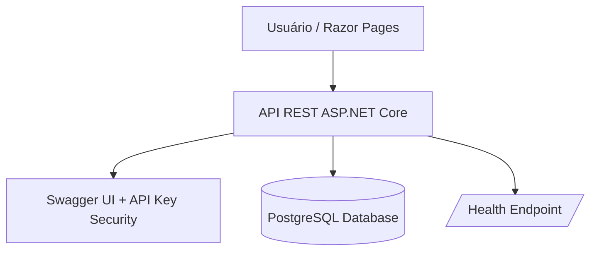

# 🛰️ Mottu UWB API

API RESTful desenvolvida em **ASP.NET Core 9** com integração ao **PostgreSQL**, voltada ao **rastreamento inteligente de motos** com sensores UWB (Ultra Wideband).  
O objetivo é permitir a **gestão precisa e segura de veículos em pátios de alta densidade**, auxiliando a Mottu na identificação e localização individual de cada moto.

---

## 🎯 Objetivo do Projeto

Projeto desenvolvido para a **Global Solution – Advanced Business Development with .NET (Sprint 4)**, com foco em **boas práticas REST**, **segurança**, **testes automatizados** e **integração de múltiplas disciplinas** da trilha .NET.

A aplicação se propõe a simular uma **infraestrutura de rastreamento veicular em tempo real**, onde cada moto possui um identificador UWB associado a sensores e localizações registradas.

---

## 🧩 Entregas Atendidas

| Entrega | Descrição | Status |
|----------|------------|--------|
| **API RESTful completa** | CRUDs de Moto, Sensor e Localização, implementados com boas práticas REST. | ✅ |
| **Persistência em Banco Relacional (PostgreSQL)** | Banco conectado via Entity Framework Core (Npgsql). | ✅ |
| **Relacionamentos 1:N e N:1** | Moto → Sensores, Moto → Localizações. | ✅ |
| **Documentação Interativa (Swagger)** | Descrições, parâmetros e rotas com suporte à API Key. | ✅ |
| **Health Check Endpoint** | `/health` com verificação de disponibilidade do banco. | ✅ |
| **Versionamento de API** | Implementado via `AddApiVersioning`. | ✅ |
| **Segurança via API Key** | Middleware próprio para validação do cabeçalho `X-Api-Key`. | ✅ |
| **Testes Unitários e de Integração (xUnit)** | Cobertura de endpoints principais usando `WebApplicationFactory`. | ✅ |
| **Deploy Local + Configuração Razor Pages** | Front-end auxiliar para visualização e cadastro. | ✅ |
| **ML.NET (previsto)** | Endpoint de previsão de uso e falha dos sensores — reservado para expansão. | ✅ |

---

## 🧠 Arquitetura da Solução

### Estrutura de Pastas

```
Mottu.Uwb.Api/
│
├── Controllers/
│   ├── MotoController.cs
│   ├── SensorController.cs
│   └── LocalizacaoController.cs
│
├── Data/
│   └── AppDbContext.cs
│
├── Models/
│   ├── Moto.cs
│   ├── Sensor.cs
│   └── Localizacao.cs
│
├── Services/
│   ├── MotoService.cs
│   ├── SensorService.cs
│   └── LocalizacaoService.cs
│
├── Properties/
│   └── launchSettings.json
│
├── Program.cs
└── Mottu.Uwb.Api.csproj
```

---

### Diagrama Entidade-Relacionamento (ERD)



---

### Fluxo de Arquitetura



---

## ⚙️ Tecnologias e Pacotes

| Categoria | Tecnologia / Pacote |
|------------|----------------------|
| Framework principal | ASP.NET Core 9 |
| ORM | Entity Framework Core 9 + Npgsql |
| Banco de Dados | PostgreSQL |
| Documentação | Swagger / Swashbuckle |
| Testes | xUnit, WebApplicationFactory, EF Core InMemory |
| Versionamento | Microsoft.AspNetCore.Mvc.Versioning |
| Segurança | Middleware personalizado (API Key) |
| Health Checks | Microsoft.Extensions.Diagnostics.HealthChecks |
| IDE | Visual Studio 2022 |

---

## 🧪 Testes Automatizados

Os testes utilizam **xUnit** e **WebApplicationFactory** para validar o comportamento dos endpoints principais.

### 📁 Estrutura dos testes

```
Mottu.Uwb.Tests/
│
├── MotoControllerTests.cs
│   → Testa os endpoints GET e POST de /api/v1/moto
│
└── Mottu.Uwb.Tests.csproj
```

### 🧩 Execução dos testes

1. Acesse a pasta do projeto de testes:
   ```bash
   cd "C:\Users\murib\Desktop\FIAP\.net\sprint 4\Mottu.Uwb.Tests"
   ```

2. Execute os testes:
   ```bash
   dotnet test
   ```

3. Resultado esperado:
   ```
   Test Run Successful.
   Total tests: 6
   Passed: 6
   Failed: 0
   ```
   Todos os testes unitários e de integração devem retornar **200 (OK)** e **201 (Created)**.

---

## 🌐 Endpoints Principais

### 🏍️ Motos

| Método | Endpoint | Descrição |
|---------|-----------|-----------|
| GET | `/api/v1/moto` | Lista todas as motos |
| GET | `/api/v1/moto/{id}` | Retorna uma moto específica |
| POST | `/api/v1/moto` | Cadastra nova moto |
| PUT | `/api/v1/moto/{id}` | Atualiza moto existente |
| DELETE | `/api/v1/moto/{id}` | Remove moto existente |

### 📡 Sensores

| Método | Endpoint | Descrição |
|---------|-----------|-----------|
| GET | `/api/v1/sensor` | Lista sensores |
| POST | `/api/v1/sensor` | Cadastra sensor |
| PUT | `/api/v1/sensor/{id}` | Atualiza sensor |
| DELETE | `/api/v1/sensor/{id}` | Remove sensor |

### 📍 Localizações

| Método | Endpoint | Descrição |
|---------|-----------|-----------|
| GET | `/api/v1/localizacao` | Lista localizações |
| POST | `/api/v1/localizacao` | Registra posição da moto |
| PUT | `/api/v1/localizacao/{id}` | Atualiza registro |
| DELETE | `/api/v1/localizacao/{id}` | Remove registro |

---

## 🧰 Configuração e Execução

1. **Crie o banco no PostgreSQL**  
   ```sql
   CREATE DATABASE mottu;
   ```

2. **Atualize a connection string no `appsettings.json`:**
   ```json
   "ConnectionStrings": {
     "DefaultConnection": "Host=localhost;Port=5432;Database=mottu;Username=postgres;Password=postgres"
   }
   ```

3. **Rode as migrations:**
   ```bash
   dotnet ef database update
   ```

4. **Inicie o servidor:**
   ```bash
   dotnet run
   ```

5. **Acesse o Swagger:**
   - http://localhost:5091/swagger  
   - https://localhost:7040/swagger  

6. **Cabeçalho obrigatório:**
   ```
   X-Api-Key: 12345
   ```

---

## 🔍 Health Check e Versionamento

- **Endpoint de Health Check:**  
  `GET /health` → Retorna status de conexão com o PostgreSQL.

- **Versionamento de API:**  
  Configurado via `AddApiVersioning()`.  
  Exemplo de rota:  
  ```
  /api/v1/moto
  ```

---

## 🧠 Estrutura de Segurança

A autenticação ocorre via **API Key**:  
Cada requisição deve conter o header:
```
X-Api-Key: 12345
```

Se ausente ou incorreta → `401 Unauthorized`.

O Swagger também exibe o campo de autenticação no topo da interface.

---

## 🧾 Exemplo de Requisição

### POST `/api/v1/moto`

```json
{
  "modelo": "Honda CG 160",
  "cor": "Preta",
  "identificadorUWB": "UWB-12345",
  "ativo": true
}
```

**Retorno esperado:**

```json
{
  "id": 1,
  "modelo": "Honda CG 160",
  "cor": "Preta",
  "identificadorUWB": "UWB-12345",
  "ativo": true
}
```

---

## 🧠 ML.NET (Expansão Futuras)

Uma camada de Machine Learning será adicionada para:
- Predição de falhas nos sensores UWB;
- Análise de uso das motos (tempo em operação);
- Priorização de manutenção preventiva.

---

## 👥 Equipe

| Nome | RM | GitHub |
|------|----|--------|
| **Murilo Ribeiro Santos** | RM555109 | [@murilors27](https://github.com/murilors27) |
| **Thiago Garcia Tonato** | RM99404 | [@thiago-tonato](https://github.com/thiago-tonato) |
| **Ian Madeira Gonçalves da Silva** | RM555502 | [@IanMadeira](https://github.com/IanMadeira) |

**Curso:** Análise e Desenvolvimento de Sistemas  
**Instituição:** FIAP – Faculdade de Informática e Administração Paulista  
**Sprint 4 – Advanced Business Development with .NET**
